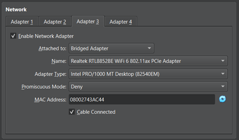
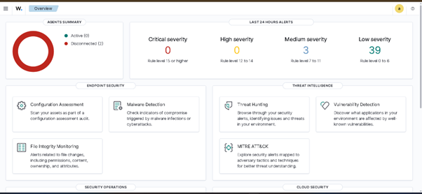
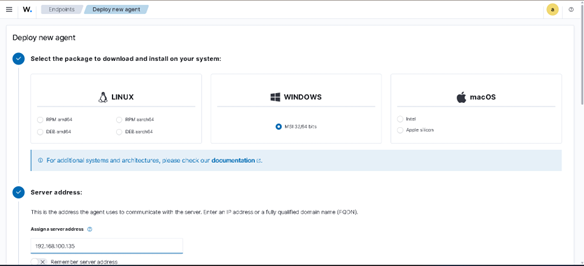
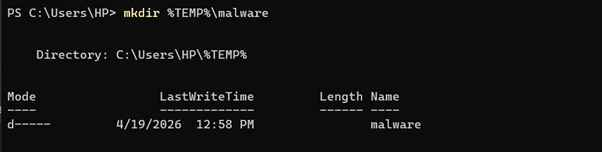
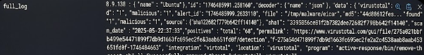

# Wazuh SIEM Lab – Automated Threat Detection & Response

A hands-on cybersecurity project demonstrating real-time threat detection, threat intelligence integration, and automated incident response using Wazuh.

---

## Overview

This project simulates an enterprise-grade **Security Information and Event Management (SIEM)** environment. It goes beyond traditional monitoring by implementing a **closed-loop security workflow**:

**Detection → Analysis → Enrichment → Automated Response**

The system detects file-based threats, validates them using external intelligence, and automatically removes malicious files in real time.

---

## Tech Stack

* Wazuh SIEM (Linux Virtual Appliance)
* VirusTotal API (Threat Intelligence)
* Python (Active Response Automation)
* PowerShell (Windows Administration)
* XML (Wazuh Configuration)
* Windows 11 & Kali Linux (Endpoints)

---

## Key Features

* Centralized log collection and monitoring
* File Integrity Monitoring (FIM) for real-time detection
* Integration with VirusTotal for malware verification
* Automated threat removal using Python scripts
* Cross-platform endpoint monitoring
* Scalable agent configuration using Wazuh groups

---

## Architecture Workflow

1. File is created in a monitored directory
2. Wazuh detects the change using FIM
3. File hash is sent to VirusTotal
4. If flagged as malicious → alert triggered (**Rule ID 87105**)
5. Active Response script executes
6. Malicious file is automatically deleted

---

## Screenshots

### 1. Environment Setup

#### Network Configuration




#### Virtual Machine Setup


#### Initial Access


---

### 2. Wazuh Deployment & Dashboard




---

### 3. Agent Deployment




---

### 4. File Integrity Monitoring (FIM)




#### Attack Simulation


#### Detection


---

### 5. VirusTotal Integration


#### Malware Testing


#### Detection Events


#### Analysis


---

### 6. Active Response Automation

#### Setup


#### Configuration


---

### 7. Automated Response Testing


---

### 8. Logs & Analysis





---

## Project Structure

```
wazuh-siem-lab/
├── README.md
├── report/
│   └── wazuh_report.md
├── images/

```

---

## How to Reproduce

1. Install Wazuh Manager (Virtual Appliance)
2. Deploy agent on Windows endpoint
3. Configure File Integrity Monitoring (FIM)
4. Integrate VirusTotal API in `ossec.conf`
5. Enable Active Response module
6. Deploy Python response script
7. Test using EICAR malware sample

---

## Full Report

For detailed implementation, configuration, and analysis:

--> `wazuh_report.md`

---

## Gained

* Practical SIEM deployment and configuration
* Event correlation and threat detection
* Integration of external threat intelligence
* Automation of incident response workflows
* Reduction of Mean Time to Respond (MTTR)

---

## Future Improvements

* Implement false positive filtering (whitelisting)
* Extend automation (IP blocking, account isolation)
* Secure API key storage
* Improve logging and auditing
* Develop custom detection rules

---

## Authored and implemented
Khalid Abdullahi

Cybersecurity Student | SIEM & Automation Enthusiast
